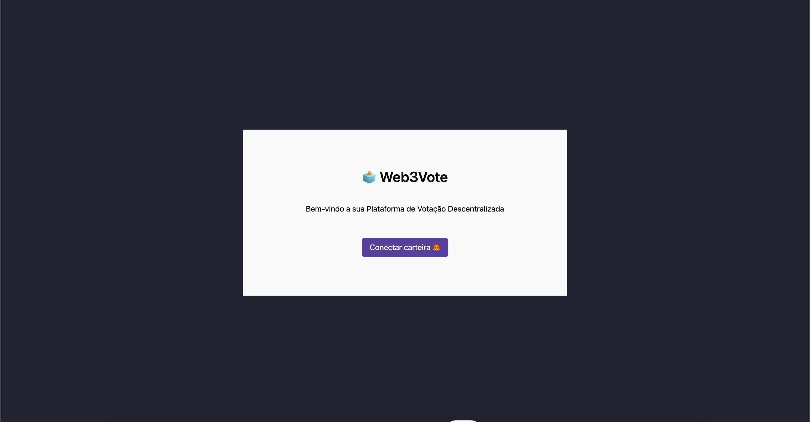

<p align="center">
	
</p>

<h1 align="center">Web3Vote</h1>

## Status

<h4 align="center"> 
	Web3Vote - In Progress 🚧
</h4>

## Description

The repository is the project for completing the Digital Systems and Media undergraduate program at the Federal University of Ceará. It deals with a platform for conducting ballots from a decentralized blockchain-based system.

## Content

- [Description](#description)
- [Status](#status)
- [Content](#content)
- [How to use it?](#how-to-use-it)
- [Stack and Technoloy](#stack-and-technology)

## How to use it?

Web3Vote is a front-end project.

1. Clone the repository

```
git clone https://github.com/ericiannj/web3vote.git
```

2. Install the front-end dependencies;

```
npm install
```

3. Create the .env file and put the smart contract address.

```
VITE_BALLOT_CONTRACT_ADDRESS=
```

4. Run the code.

```
npm run dev
```

Obs: The VITE_BALLOT_CONTRACT_ADDRESS is resulted from the BallotContract deploy.

## Stack and Technology

- Vite
- Typescript
- React JS
- Tailwind CSS

## Application Photos


